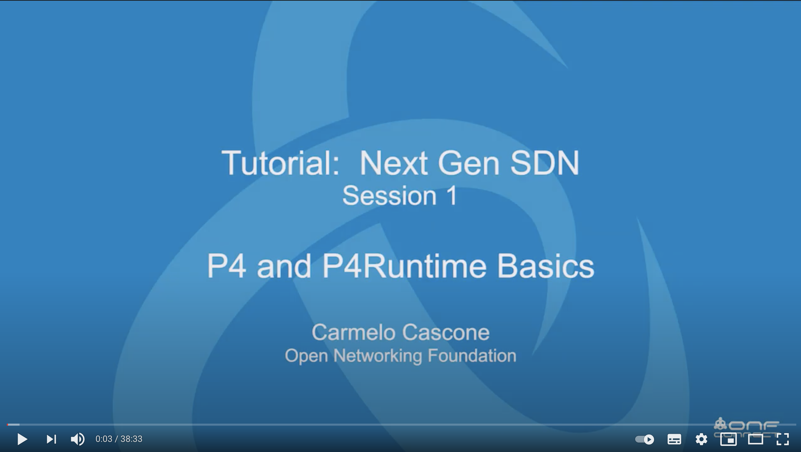
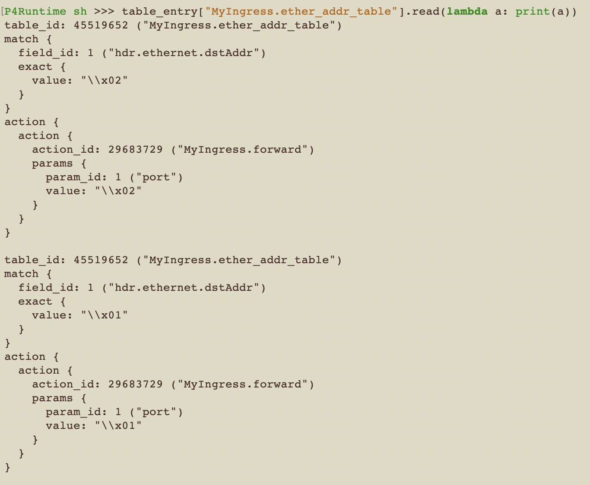

## P4runtime in action!

# Table of Contents

1. [Setup](#1-setup)
2. [Exercise overview](#2-exercise-overview)
3. [What is P4Runtime](#3-what-is-p4runtime)
4. [Action](#4-action)
5. [References](#5-references)

### 1. Setup

For this tutorial you have access to three dockerized tools to work with:

* P4 compiler ([source](https://github.com/p4lang/p4c))
* P4Runtime-enabled Mininet ([source](https://github.com/opennetworkinglab/p4mn-docker))
* IPython shell for P4Runtime ([source](https://github.com/p4lang/p4runtime-shell))

We use Mininet to create simple topology with 2 hosts and a switch. The P4Runtime Shell is used as the controller role. 
It uses gRPC to connect the controller and the switch. 
After P4Runtime Shell starts, it will install specified P4 program to the switch through the gRPC connection.

Clone git repository 
```
git clone https://github.com/mikiisz/p4runtime-in-action.git
```
and move to created directory
```
cd p4runtime-in-action/
```

  
*Img 1: Network configuration*

#### 1.1. Compile P4 switch definition

Start P4 compiler shell:

```
docker-compose run compiler
```

This docker has attached a `./configs` directory as its volume. 
You can find there necessary dependencies for network configuration. 
Compile `setup_switch.p4`:

```
cd configs

p4c --target bmv2 --arch v1model --p4runtime-files p4info.txt setup_switch.p4 
```

As an output, it will generate a few files with definition of our testing switch. 
Later, we will launch the P4 Runtime Shell, using the p4info.txt and setup_switch.json files generated.

#### 1.2. Launch the Mininet Environment

Start a Mininet environment that supports the P4 Runtime in docker environment. 
Note that at boot time, the `--arp` and `--mac` options allow you to do things like ping tests without ARP processing. 
Below command will create a simple topology for our exercise:

```
docker-compose run mininet --arp --topo single,2 --mac
```

After successful creation, docker will switch into an interactive mode:
```
*** Creating network
*** Adding controller
*** Adding hosts:
h1 h2
*** Adding switches:
s1
*** Adding links:
(h1, s1) (h2, s1)
*** Configuring hosts
h1 h2
*** Starting controller

*** Starting 1 switches
s1 ..⚡️ simple_switch_grpc @ 50001
```

you can check built topology and host configs by executing:

```
mininet> net
```
as a result you should see logs like this:
```
h1 h1-eth0:s1-eth1
h2 h2-eth0:s1-eth2
s1 lo:  s1-eth1:h1-eth0 s1-eth2:h2-eth0
```

```
mininet> h1 ifconfig h1-eth0
```

Make sure to leave that mininet server running in the background.

#### 1.3. Connect P4 Runtime Shell to Mininet

Start P4 Runtime Shell. 
Make sure to connect properly to your mininet server running in the background from step *1.2*. 
You can find the server id by running `sh ifconfig` in the mininet terminal:

```
mininet> sh ifconfig
eth0: flags=4163<UP,BROADCAST,RUNNING,MULTICAST>  mtu 1500
        inet 172.18.0.2  netmask 255.255.0.0  broadcast 172.18.255.255
        ether 02:42:ac:12:00:02  txqueuelen 0  (Ethernet)
        RX packets 14  bytes 1116 (1.0 KiB)
```

In this case ip addres is `172.18.0.2`, connect to you Mininet server using ip address and port 50001 on which Mininet is running:

```
docker-compose run shell --grpc-addr 172.18.0.2:50001 --device-id 1 --election-id 0,1 --config /tmp/configs/p4info.txt,/tmp/configs/setup_switch.json
```

Let's display the preset tables (created in `./configs/setup_swish.p4` file) to confirm that it works:

```
P4Runtime sh >>> tables 

P4Runtime sh >>> tables["MyIngress.ether_addr_table"] 
Out[2]:
preamble {
  id: 45519652
  name: "MyIngress.ether_addr_table"
  alias: "ether_addr_table"
}
match_fields {
  id: 1
  name: "hdr.ethernet.dstAddr"
  bitwidth: 48
  match_type: EXACT
}
action_refs {
  id: 29683729 ("MyIngress.forward")
}
action_refs {
  id: 25585187 ("MyIngress.to_controller")
}
size: 1024
```

Congratulations, your setup is finished.

#### 1.4 Automated setup

For future works, to make your life easier, you can use these oneliners to automate the setup of above steps:

```
docker-compose -f docker-compose.automated.yml run mininet

docker-compose -f docker-compose.automated.yml run shell
```

Confirm the results by running:

```
P4Runtime sh >>> tables 

P4Runtime sh >>> tables["MyIngress.ether_addr_table"] 
```

### 2. Exercise overview

The exercise's goal is to enable connectivity between two hosts via a P4 runtime table definition. 
After setting up a based mininet network, switch tables are empty, which blocks all data request coming in and out from hosts. 
With a use of P4 Runtime interactive shell we will try to update tables definitions to allow traffic between hosts. 
This exercise is a simple use case to understand how to interact with switched with a help of P4 runtime api.

### 3. What is P4Runtime?

It is a control protocol for P4-defined data planes. 
It simplifies management of a P4 switch `Data plane`, which decreases necessary configuration and dependencies for traffic control. 
The P4Runtime API is a control plane specification for controlling the data plane elements of a device defined or described by a P4 program. 
Below figure represents the P4Runtime Architecture. The device or target to be controlled is at the bottom, and one or more controllers is shown at the top. 
A role defines a grouping of P4 entities.

  
*Img 2: P4Runtime architecture*

The P4Runtime API defines the messages and semantics of the interface between the client(s) and the server. 
The API is specified by the p4runtime.proto Protobuf file.
It is the responsibility of target implementers to instrument the server.
The controller can access the P4 entities which are declared in the P4Info metadata. 
The P4Info structure is defined by p4info.proto, another Protobuf file available as part of the standard.

We are recommending to watch this short explanation of P4 and P4 runtime workflow. 
It gives great understanding of concepts behind the API and helps to go through the prepared exercises without doubts:

[](https://www.youtube.com/watch?v=KRx92qSLgo4)

### 4. Action!

Let's get our hands dirty and set up our first switch table. 

Try to ping host h1 with host h2 in mininet console:

```
mininet> h1 ping -c 1 h2
```

It fails, as there is no rules set in switch table.

```
PING 10.0.0.2 (10.0.0.2) 56(84) bytes of data.

--- 10.0.0.2 ping statistics ---
1 packets transmitted, 0 received, 100% packet loss, time 0m
```

In the setup stages we complied switch definition, where we defined a basic empty table called `MyIngress.ether_addr_table`.

  
*Img 3: Empty table definition*

The ids associated with table and actions will differ in your example as they are generated once per instance. 
Notice that we have described two actions: `MyIngress.forward` and `MyIngress.to_controller`.
The first one is an action that will be used provide a connection between host 1 (switch port 1) and host 2 (switch port 2).
The second is used as an action definition to switch controller.
To find its P4 definition check `./configs/setup_switch.p4` file and `MyIngress` controller.

#### 4.1. Add egress rule to port 2, host 2

We start by adding an entry to predefined switch ingress table. The protobuf data structure for P4 runtimes rule looks like this:

```
updates {
  type: <TYPE>
  entity {
    table_entry {
      table_id: <TABLE ID>
      match {
       <MATCH RULE>
      }
      action {
        action {
          action_id: <ACTION ID>
          params {
            <PARAMS>
          }
        }
      }
    }
  }
}
```

Fields defined with `< >` needs to be supplied according to the policies defines in `.p4` document. 
Especially the `<MATCH RULE>` and `<PARAMS>` must satisfy `MyIngress` control.
For this exercise we prepared a template which you can reuse: `./config/forward_to_h2.pb`.

The `table_id` stands for `MyIngress.ether_add_table`, and the `id` in its `match` field stands for `hdr.ethernet.dstAddr`. 
The following hex value is 6 bytes long, meaning the MAC address `00:00:00:00:00:02`.
Similarly, `action_id` points to `MyIngress.forward`, and the value of the following `param_id`  uses 2 bytes in hexadecimal notation to indicate that the destination port. 

Our proposal looks like this:

```
updates {
  type: INSERT
  entity {
    table_entry {
      table_id: 0 # TODO: provide table Id
      match {
        field_id: 1
        exact {
          value: "\x00\x00\x00\x00\x00\x02"
        }
      } 
      action {
        action {
          action_id: 0 # TODO: provide action id
          params {
            param_id: 1
            value: "\x00\x02"
          }
        }
      }
    }
  }
}
```

After setting up the protobuf file, we can add it and view it with a usage of:

```
P4Runtime sh >>> Write("/tmp/configs/forward_to_h2.pb")

P4Runtime sh >>> table_entry["MyIngress.ether_addr_table"].read(lambda a: print(a))
```

  
*Img 4: Table with added forward rule*

Let's check if the pinging works now:

```
mininet> h1 ping -c 1 h2
```

It fails again. To provide connectivity we need to add rule to route the packet back to the sender.

#### 4.2. Route back packet to port 1, host 1

We need to add another entry to the table to verify that the ping packets are correctly going back and forth between the two hosts.
Just like in the above step we need to update `MyIngress.ether_add_table` to unblock traffic.
The rules for adding the table update are the same.
If you need some additional support, we prepared a template for that in `./configs/route_back_to_h1.pb`.
However, try to provide that protobuf file based on the example from step *1.4*.

After that step, we expect to have such a switching table:

  
*Img 5: Switching table*

#### 4.3. Ping hosts

```
mininet> h1 ping -c 1 h2

mininet> h2 ping -c 1 h1
```

Try to confirm if pinging works in both directions.
We owe that condition thanks to the table rules we added.
Let's check them to confirm what was needed:

```
P4Runtime sh >>> table_entry["MyIngress.ether_addr_table"].read(lambda a: print(a))
```

  
*Img 6: Final version of the table*

### 5. References

* [P4Runtime firstbite](https://github.com/yyasuda/P4Runtime-firstbite)
* [P4Runtime tutorial from P4lang](https://github.com/p4lang/tutorials/tree/master/exercises/p4runtime)
* [Next-Gen SDN Tutorial from ONF](https://www.youtube.com/watch?v=KRx92qSLgo4)